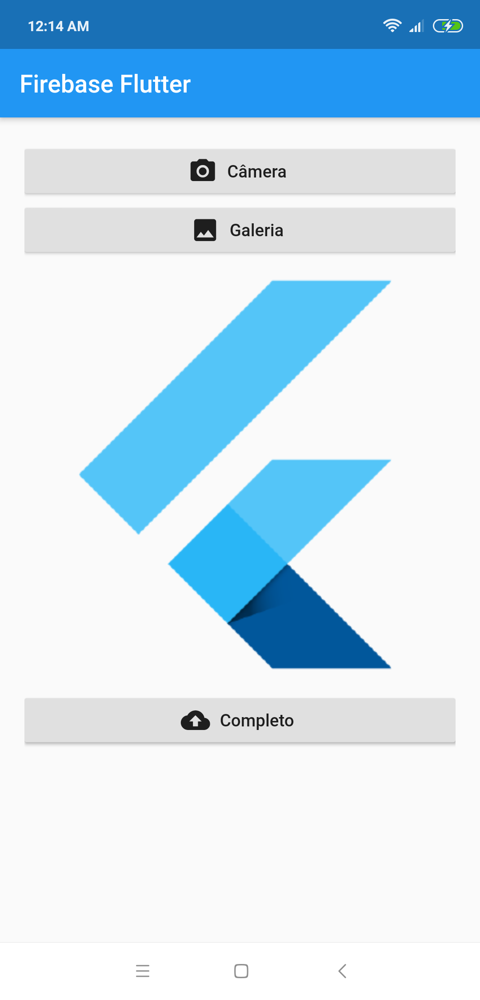

# Firebase Flutter

Aplicação utilizando firebase.

## Helper

 - [Adicionar o Firebase a seu app Flutter](https://firebase.google.com/docs/flutter/setup)
 - [FlutterFire](https://github.com/FirebaseExtended/flutterfire)
 - [Evitar o limite de 64 K](docs/limits64.md)
 
## Pacotes

 - [Firebase Core](https://pub.dev/packages/firebase_core)
 - [Cloud Firestore](https://pub.dev/packages/cloud_firestore)
 - [Firebase Cloud Storage](https://pub.dev/packages/firebase_storage)
 - [Firebase Authentication](https://pub.dev/packages/firebase_auth)

## Getting Started

This project is a starting point for a Flutter application.

A few resources to get you started if this is your first Flutter project:

- [Lab: Write your first Flutter app](https://flutter.dev/docs/get-started/codelab)
- [Cookbook: Useful Flutter samples](https://flutter.dev/docs/cookbook)

For help getting started with Flutter, view our
[online documentation](https://flutter.dev/docs), which offers tutorials,
samples, guidance on mobile development, and a full API reference.
